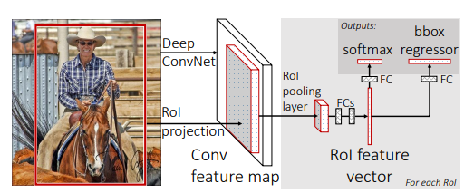
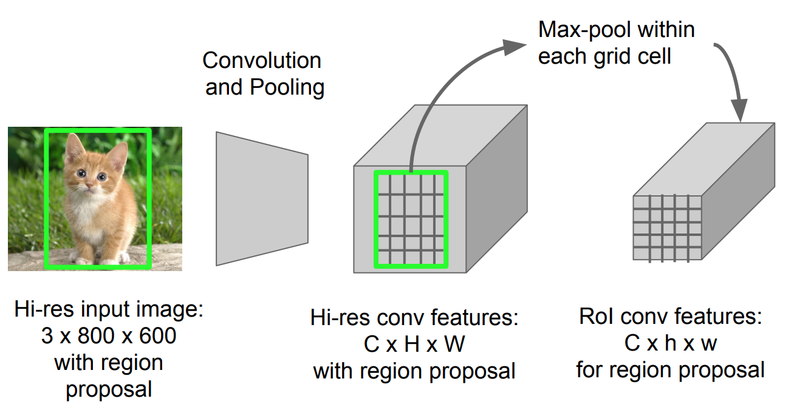

# Fast R-CNN論文を読んだメモ

## Abstractの翻訳
本論文では物体認識のための, 高速になったR-CNN(Fast R-CNN)を提案する. Fast R-CNNは深層畳み込みニューラルネットワークを用いて, 物体提案を効率的に分類する先行研究に基づいて構築されている.
先行研究と比較すると, Fast R-CNNは訓練およびテストにかかる時間を改善し, さらに検出精度を増加させるいくつかの技術改革を採用している. Fast R-CNNはR-CNNよりも学習においては9倍, テストでは213倍高速に実行できるVGG16で学習され, PASCAL VOC 2012でR-CNNよりも高いmAPを達成した. SPPnet(CNNを用いた別の手法)と比較すると, Fast R-CNNは学習で3倍, テストで10倍の速度で実行でき, より正確である. Fast R-CNNはPythonとC++で実装され, MIT Licenseの下で入手可能である. 

## 背景
R-CNNの問題点として, region proposal(物体領域候補の提案)がGPUで1画像あたり13s, CPUで53s, VGG16を用いたR-CNNモデルでは47 s/imageかかるという問題があった. またCNNとSVMの学習を個別に行う必要があり, マルチステージの学習では時間がかかるという問題があった. このように物体領域候補の提案処理にかかる時間と, マルチステージで学習を行うためにかかる時間を短縮したいという目標がある.   
→ 物体提案の分類と, 位置特定の洗練を同時に学習する**シングルステージ**のアルゴリズムを提案

## Fast R-CNNのアーキテクチャ
Fast R-CNNのアーキテクチャについて説明する. 入力画像はCNNおよびSelective Searchに入力され, CNNからは特徴量マップ, Selective SearchからはRoI(Region of Interst)が得られる. 次に特徴量マップ上にRoIを射影し, その結果得られた特徴量マップをRoI poolingに入力する. RoI poolingの結果は数段のFCレイヤーで処理され回帰器でバウンディングボックス, 分類器でラベルが求められる.  

特徴量マップ上でRoIを射影する部分では, RoIに対応する部分の特徴量を抜き出す作業が行われる. 例えば次に示すようなネコの画像をCNNに入力して特徴量マップ, Selective Searchに入力して緑枠がRoIとして得られたとする. このRoIを用いて特徴量マップ上で射影を行うとC×H×Wの領域が特徴量マップからクリップされる.

RoI Poolingレイヤーでは任意長の特徴量マップを入力, 固定長の特徴量マップを特徴とするMax Poolingが実行される. RoI(入力される特徴量マップ)のサイズがw×h, 固定長の特徴量(出力)のサイズがW×Hであるときは, RoIをウィンドウサイズが(w/W)×(h/H)のサブウィンドウに分割し, 各サブウィンドウでMax Poolingが実行される. そしてその結果を結合してRoI Pooling layerの出力とする. 例えばRoIのサイズが21×21, 出力特徴量のサイズが7×7のときはRoIをウィンドウサイズ3×3のサブウィンドウに分割してMax Poolingが実行され, 7×7の特徴量マップが出力される.  
R-CNNではSelective Searchが1回実行された後にRoIの数だけCNNや分類・回帰のレイヤーが実行されていた. Fast R-CNNはCNNおよびSelective SearchとCNNが1回実行された後, RoI Poolingや分類・回帰の処理がRoIの数だけ実行される. CNNの処理は比較的時間がかかる処理であるから, この処理の回数を1回に短縮したことで大幅な時間削減が行えていると考える.

## 成果・性能
### 精度について
VOC2012データセットでmAPが68.4%でありSoTAを達成した. ただしVOC2010では12年のデータのみを用いた場合にはSegDeepMの方がmAPが高い(FRCNが66.1%, SegDeepMが67.2%). VOC2007においてはFRCNのmAPは66.9%, 認識が難しい物体を除いた場合のmAPは68.1%である.

### 実行速度について
学習についてはR-CNNがSモデルで22h, Mモデルで28h, Lモデルで84hだったのに対して, Fast R-CNNはSモデルで1.2h, Mモデルで2.0h, Lモデルで9.5hであった. Sモデルで18.3倍, Mモデルで14.0倍, Lモデルで8.8倍という高速化であるため, モデルを改良したことで1日程度かかった計算が1~5h程度に短縮できている. 
テスト時については, R-CNNモデルがSモデルで9.8s/image, Mもモデルが12.1image/s, Lモデルが47image/sであったのに対してFast R-CNNはSモデルで0.10s/image, Mモデルは0.15s/image, Lモデルは0.32s/imageであるため3～10fps程度のリアルタイム検出も行える性能である.

## 問題点
- CNNは1画像に付き1回しか実行しないため計算コストの削減に寄与しているが, RoIの処理や分類・回帰の処理はRoIの数だけ行われるため計算コストとメモリ使用量が高いこと
- Region Proposalの処理に時間がかかるためリアルタイム物体認識には向いていないこと

## 参考文献
[1] Ross Girshick, "Faster R-CNN"